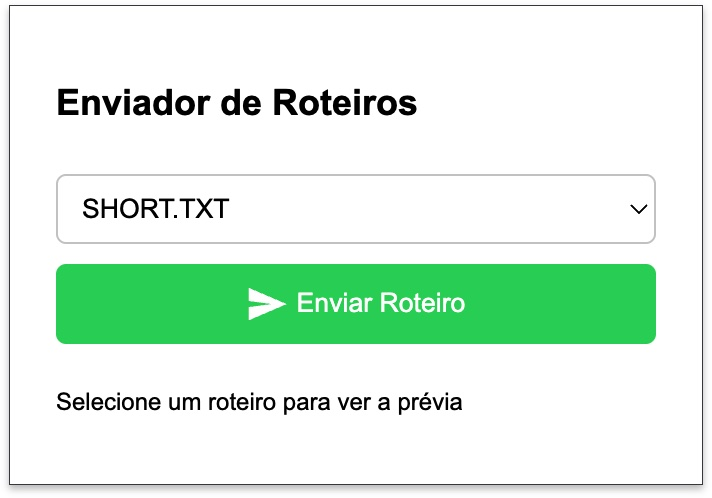

# SendScriptWhatsApp

Código para enviar um Script maneiro para seus amigos ou grupos do WhatsApp.
A ideia é manter um repositório Open Source onde todos possam contribuir para fazermos uma gigantesca coleção de scripts possíveis de serem enviadas pelo Whatsapp para nossos amigos.

## Utilização

Abra qualquer arquivo do diretório `scripts`

Copie todo o conteúdo (clique em raw -> ctrl+a -> ctrl+c)

 **Atalhos:**
   - `Ctrl+A` = selecionar tudo
   - `Ctrl+C` = copiar

No WhatsApp Web, na conversa desejada, abra o console do Browser (F12 se usar chrome, chromium, brave e derivados)

|  ⚠️ Aviso importante, numa atualização recente do Google Chrome, está sendo impedido que qualquer script seja colado no Console.|
|--|
|  ***Para contornar esse problema, o console do desenvolvedor espera receber um confirmação textual escrevendo no console: "allow pasting"***| 
|Após isso será permitido colar e continuar a execução do script|

Cole o código no console e aperte Enter

Pronto, veja a mágica acontecer

## Instalação

Para utilizar o SendScriptWhatsApp, você não precisa de nenhuma instalação adicional. Basta clonar este repositório e acessar os scripts desejados.

## Plugin navegador

Uma extensão para Chrome que permite enviar roteiros automaticamente no 
WhatsApp Web.

## Contribuição

Leia o arquivo [`CONTRIBUTING.MD`](https://github.com/Douglas019BR/SendScriptWhatsApp/blob/main/CONTRIBUTING.md)
