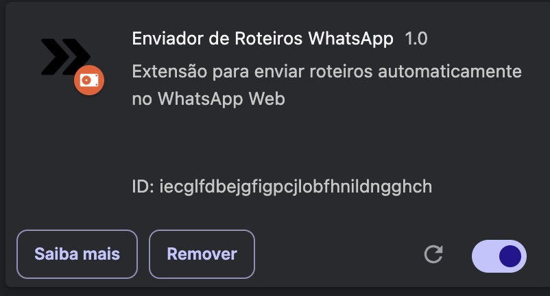

# Enviador de Roteiros WhatsApp

Uma extensão para Chrome que permite enviar roteiros automaticamente no WhatsApp Web.

## 🚀 Funcionalidades

- Envio automático de roteiros no WhatsApp Web
- Interface amigável e intuitiva
- Suporte a múltiplos roteiros
- Fácil configuração e personalização

## 📦 Instalação

1. Clone este repositório:
```bash
git clone https://github.com/Dayanfreitas/SendScriptWhatsApp.git
```

2. Abra o Chrome e vá para `chrome://extensions/`
3. Ative o "Modo do desenvolvedor" no canto superior direito
4. Clique em "Carregar sem compactação"
5. Selecione esta pasta `extension` do projeto
6. Pronto, instalado!



## 🛠️ Como Configurar Roteiros

Para contribuir com novos roteiros, siga estes passos:

1. Acesse a pasta `data/`
2. Crie um novo arquivo com extensão `.txt`
3. Escreva seu roteiro seguindo o formato:
```
Título do Roteiro
---
Mensagem 1
---
Mensagem 2
---
Mensagem 3
```

Cada mensagem será enviada separadamente, com uma pequena pausa entre elas.

### Exemplo de Roteiro:
```
Apresentação Inicial
---
Olá! Tudo bem?
---
Me chamo [Seu Nome] e sou especialista em [Sua Área]
---
Gostaria de apresentar nossos serviços...
```

## 🤝 Como Contribuir

1. Faça um Fork do projeto
2. Crie uma branch para sua feature (`git checkout -b feature/AmazingFeature`)
3. Commit suas mudanças (`git commit -m 'Add some AmazingFeature'`)
4. Push para a branch (`git push origin feature/AmazingFeature`)
5. Abra um Pull Request

## 📝 Estrutura do Projeto

```
./
├── data/           # Pasta com os roteiros
├── icons/          # Ícones da extensão
├── imagem/         # Imagens utilizadas
├── manifest.json   # Configuração da extensão
├── popup.html      # Interface do usuário
├── popup.js        # Lógica da interface
├── index.js        # Script principal
└── send.js         # Funções de envio
```

## ⚠️ Requisitos

- Google Chrome
- WhatsApp Web
- Conexão com a internet

## 📄 Licença

Este projeto está sob a licença MIT. Veja o arquivo [LICENSE](../LICENSE) para mais detalhes.

## ✨ Agradecimentos

- Todos os contribuidores que ajudaram no projeto
- Comunidade open source 